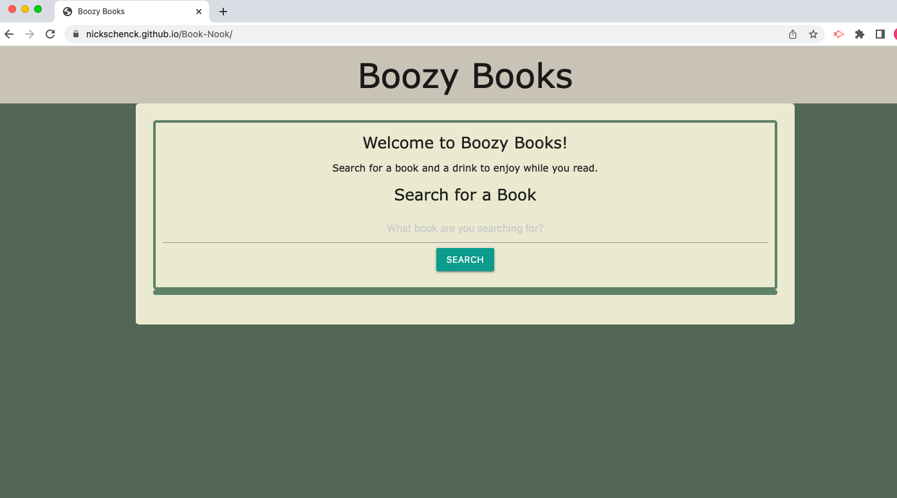

# Boozy Books

##  Boozy Books is an application for book and drink lovers! Users can search for their favorite books and find a new drink to mix up and enjoy while reading. Boozy Books helps users keep track of their "To Be Read" (TBR) book pile and also discover new delicious drinks. 

### This link will take you to the deployed portfolio:
[See deployed site here](https://nickschenck.github.io/Book-Nook/)

## Installation
### Access the code via GitHub. Install by forking the GitHub repository. 

## Usage
### This application is used to search for books and to discover new drinks to pair with the books. The user can also store book titles in the To Be Read list that saves to the page and persists. 

### These images show the site: 
#### 

## Credits
### This application was created by Michael Lundberg, Nick Schenck, Loi Tran, and Kristy Nerhaugen. 
#### Michael Lundberg's GitHub portfolio can be found here: https://github.com/lundbmp
#### Nick Schenck's GitHub portfolio can be found here: https://github.com/NickSchenck 
#### Loi Tran's GitHub portfolio can be found here: https://github.com/LoiT1020 
#### Kristy Nerhaugen's GitHub portfolio can be found here: https://github.com/KristyNerhaugen 

### This site was created using what we have learned in the BootCamp Spot modules and BootCamp classes. We used the Google Books API (https://developers.google.com/books) to populate book information. We used the Cocktail DB API (https://www.thecocktaildb.com/api/json/v1/1/random.php) to populate drink information. 

## License 
### n/a 